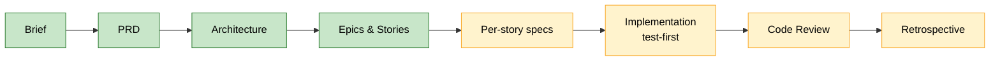
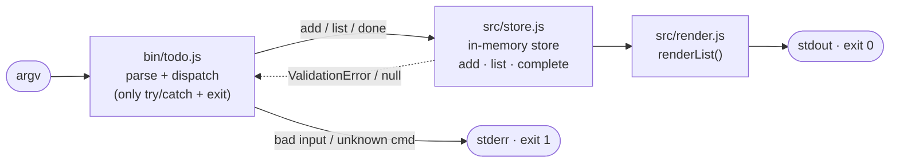

# simple-todo

A todo app reduced to its irreducible core: **Capture → View → Complete**. Add a task, see your list, mark one done. Nothing more.

## Why this exists — a BMad Method demonstration

**This project is not trying to be a todo product.** It is a clean, end-to-end demonstration of the **[BMad Method](https://github.com/bmad-code-org/BMAD-METHOD)** — taking one small, defensible idea all the way through a disciplined AI-assisted workflow:



The three features were derived from first principles — *what must be true for software to count as a todo app at all* — which is what makes the lean scope a deliberate strength rather than a shortcut. **Scope discipline is itself the thing being demonstrated:** the goal was to plan and build a complete, traceable artifact, not to add persistence, features, or polish.

The full BMad trail lives in [`_bmad-output/`](_bmad-output/):

- **Planning** — [brief](_bmad-output/planning-artifacts/briefs/), [PRD](_bmad-output/planning-artifacts/prds/), [architecture](_bmad-output/planning-artifacts/architecture.md), [epics](_bmad-output/planning-artifacts/epics.md)
- **Implementation** — one [story spec](_bmad-output/implementation-artifacts/) per slice, a [sprint tracker](_bmad-output/implementation-artifacts/sprint-status.yaml), and the [epic retrospective](_bmad-output/implementation-artifacts/epic-1-retro-2026-06-04.md)

Each story was built **test-first** and committed as its own commit, so the git history reads as the build narrative.

## Requirements

- **Node.js 24.x LTS** (targets 24.x; developed and tested on v22). Uses ES Modules and the built-in `node:test` runner.
- **Zero dependencies** — no `npm install` needed. That emptiness is part of the demonstration.

## Run it

```bash
git clone https://github.com/Ngugi1/BMad-Simple-Todo.git
cd BMad-Simple-Todo
node bin/todo.js list
```

Optionally link the `todo` command (out of scope for the demo, but supported):

```bash
npm link        # then use `todo …` instead of `node bin/todo.js …`
```

## Usage

```
todo add <text>     Capture a task (rejects empty/whitespace text)
todo list           View all tasks
todo done <id>      Complete the task with that id
```

(Invoke as `node bin/todo.js <command>`, or `todo <command>` after `npm link`.)

## Demo

```console
$ node bin/todo.js add "Write the demo script"
[ ] 1. Write the demo script

$ node bin/todo.js list
No tasks.
```

Wait — why is the list empty right after adding? **State is in-memory and lives only for one process.** Each `node bin/todo.js …` invocation starts with a fresh, empty store and exits — nothing persists across commands or restarts. This is a deliberate non-goal (see the [PRD](_bmad-output/planning-artifacts/prds/), §5), not a bug.

So the **end-to-end loop runs within a single process**. That is exactly what the smoke test exercises — here is the loop it proves:

```
add "Write the demo script"   →  [ ] 1. Write the demo script
list                          →  [ ] 1. Write the demo script
done 1                        →  [x] 1. ~~Write the demo script~~
list                          →  [x] 1. ~~Write the demo script~~
```

Completed tasks show a checked box `[x]` with struck-through text (ANSI strike-through on a real terminal; the plain `~~text~~` fallback otherwise). The checkbox is the completion signal.

## Output & error contract ("never crash")

| Invocation | Output | Exit |
|------------|--------|------|
| `add <text>`, `list`, `done <known id>` | rendered result on **stdout** | `0` |
| `add` with empty/whitespace text | `task text must not be empty` on **stderr** | non-zero |
| `done <unknown/non-numeric id>` | `No task with id "<x>".` on **stderr** | non-zero |
| unknown or missing command | `Usage: …` on **stderr** | non-zero |

No command ever prints a stack trace; success goes to stdout with exit `0`, everything else is a one-line message to stderr with a non-zero exit.

```console
$ node bin/todo.js bogus
Usage: todo <add <text> | list | done <id>>   # (stderr, exit 1)

$ node bin/todo.js add ""
task text must not be empty                    # (stderr, exit 1)
```

## Test it

```bash
npm test        # node --test → 29 tests, exit 0
```

The suite covers the store (`add`/`list`/`complete`), rendering, and the CLI — including the in-process end-to-end loop and spawn-based checks of real exit codes and stream routing.

## Project structure

How a command flows through the code (success → stdout, errors → stderr; the entrypoint is the only place that prints or sets exit codes):



```
simple-todo/
├── bin/todo.js          # CLI entrypoint: parse argv → dispatch; the only try/catch + exit codes
├── src/
│   ├── store.js         # createStore() → { add, list, complete }; in-memory, sole ID minter
│   ├── task.js          # makeTask(id, text) → { id, text, done:false }
│   ├── render.js        # renderList(tasks, { ansi }) → string (the one formatter)
│   └── errors.js        # ValidationError
├── test/                # store / render / cli tests (node:test)
└── _bmad-output/        # the BMad planning & implementation trail
```

The store sits behind a single `add`/`list`/`complete` seam, so swapping the in-memory array for file persistence later means rewriting `store.js` alone — nothing else changes.

---

*Built with the BMad Method. Scope held on purpose.*
