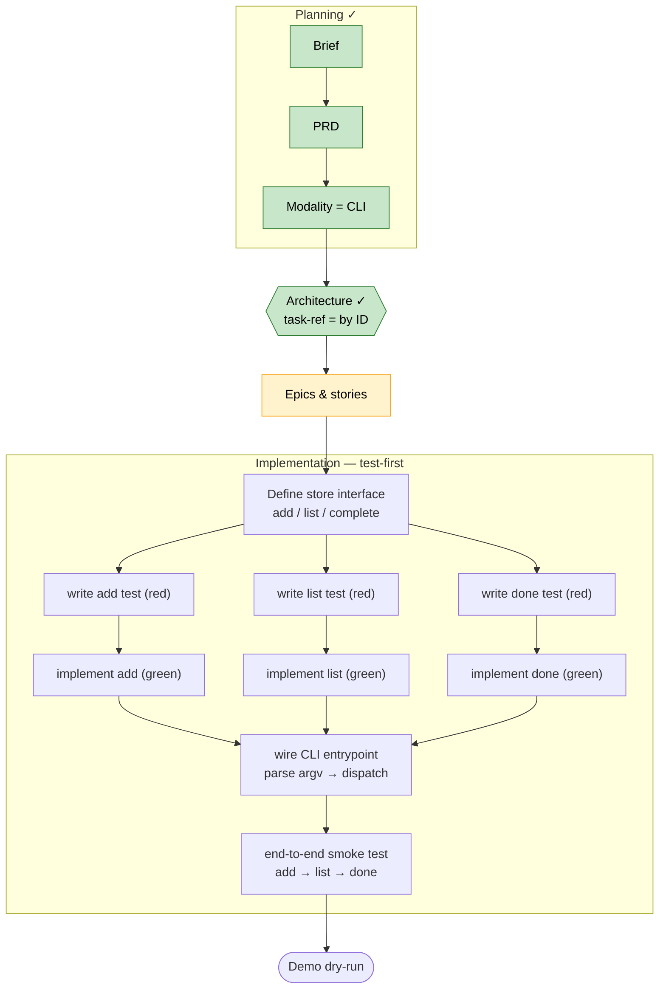

# simple-todo — Implementation Flow

**Status:** planning artifact · **Created:** 2026-06-04 · **Project:** simple-todo (BMad Method demo)

This is an **order-of-activities** diagram, not a timeline — arrows mean "must come before,"
nothing implies duration (the build is AI-assisted, so calendar time is not meaningful). It
complements the [PRD](../_bmad-output/planning-artifacts/prds/prd-simple-todo-2026-06-04/prd.md)
and [Brief](../_bmad-output/planning-artifacts/briefs/brief-simple-todo-2026-06-04/brief.md).

Mermaid is plain text on purpose: diff-able in version control and readable by both humans and AI.

## Legend

- **Green** = done · **Yellow** = active (the current gate) · plain = not started.
- **Architecture** is complete ✓ — the active gate is now **Epics & stories**. Both architecture
  questions are resolved: modality = **CLI**, task-reference = **by ID** (`todo done <id>`; the ID is
  shown in the numbered `todo list` output so it's easy to type).
- **Implementation is test-first:** each command (`add`, `list`, `done`) is a red→green pair,
  all branching off the shared in-memory store interface, then re-converging at the CLI
  entrypoint and a single end-to-end smoke test.

## Notes

- This diagram supersedes an earlier time-based Gantt draft — durations were dropped because an
  AI-assisted build makes calendar time meaningless; sequence and dependency are what matter.
- **Cost is measured in Claude tokens, not time.** Since calendar time is meaningless for an
  AI-assisted build, the unit of expense/cost estimation for this project is Claude tokens. The
  per-task (per-story) token estimates live in the [token budget](token-budget.md).
